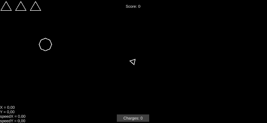
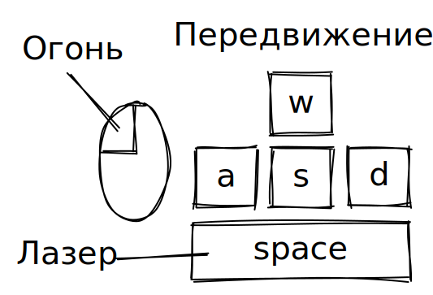
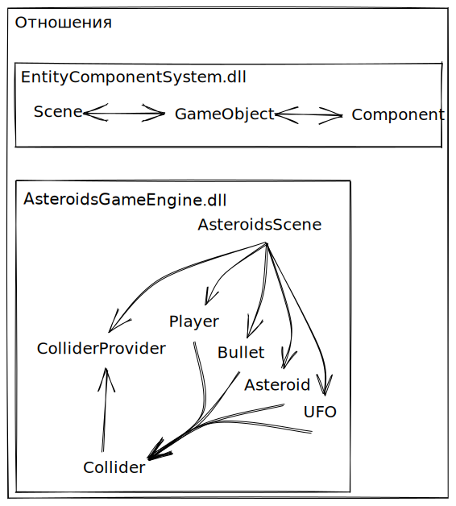
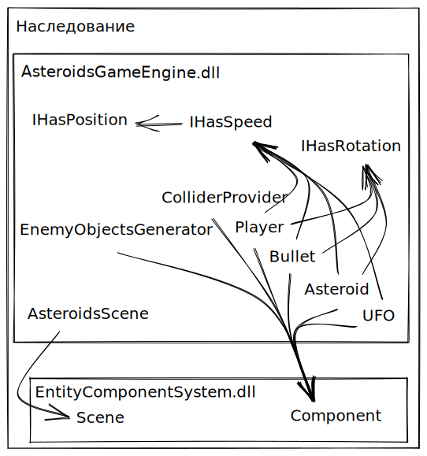

# Asteroids-ECS
Клон игры Asteroids с использованием разделенной логики на основе архитектуры Entity Component System (ECS)

# Геймплей

# Управление в игре

# Последовательность вызовов в ECS
У любого компонента есть множество виртуальных методов, на диаграмме представлена последовательность их вызово на протяжении всего жизненного цикла объекта.
 

# Основные отношения между объектами

# Наследования
